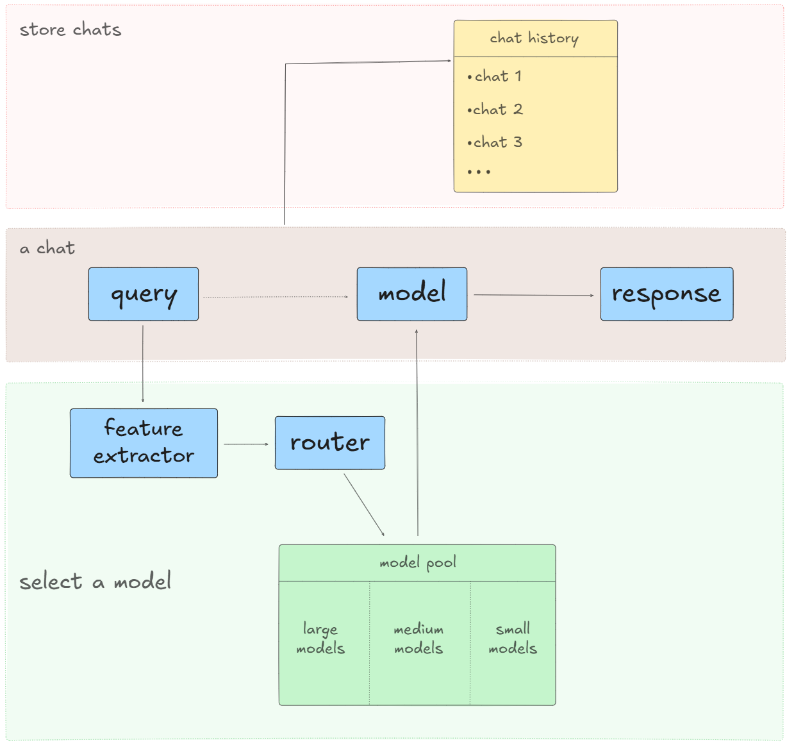

# Smart-Router



## Quick Start

1. 克隆项目

   ```sh
   git clone https://github.com/jinxinl/Smart-Router.git
   
   cd Smart-Router
   ```

2. 安装依赖

   ```
   pip install -r requirements.txt
   ```

3. 设置环境变量

   ```sh
   # 根据自己需求设置
   export ANTHROPIC_API_KEY=""
   export OPENAI_API_KEY=""
   export DEEPSEEK_API_KEY=""
   # ...
   ```

4. 在正式运行项目之前，需要先准备好训练的路由模型和小模型。

   - 准备训练路由模型所需要的数据

     ```sh
     cd data
     python generate_data_lms.py # 生成分类模型规模所需的数据
     python generate_data_task.py # 生成分类任务类型所需的数据
     cd ..
     ```

     运行成功之后，会看到在 `data/` 目录下会有 `dataset.json` 和 `task_dataset.json` 

     - `dataset.json` ：用于分类模型规模的数据
     - `task_dataset.json` ：用于分类任务类型的数据

     > 可以在 `generate_data_lms.py` 和 `generate_data_task.py` 中自定义生成数据总量和生成数据的批次大小

     

   - 训练路由模型：这里用的是XGBoost模型

     ```sh
     cd utils
     python run smart_router.py
     cd ..
     ```

     运行成功之后，会看到在 `trained_models/` 目录下有训练好的分别用于分类模型规模和分类任务类型的XGBoost模型权重、标签映射器和特征列

     

   - 小模型：从huggingface上下载

     ```sh
     python run download_hf_models
     ```

     运行成功之后，会看到 `models_cache/` 下有下载好的小模型，我的项目使用到了四个小模型，分别是：

     - Salesforce/codegen-350M-mono：代码生成
     - cardiffnlp/twitter-roberta-base-sentiment-latest：情感分析
     - deepset/roberta-base-squad2：知识问答
     - sentence-transformers/all-MiniLM-L6-v2：文本嵌入、相似度计算

     > 可以在 `get_hf_models` 中添加或移除模型配置，下载符合自己需求的模型

     

5. 当路由模型和小模型都成功配置好之后，就可以正式运行项目了

   ```sh
   python run app.py
   ```

   点击访问地址，就可以进入聊天界面了。可以在主聊天区域发送对话，得到模型回复，回复最后会注明模型信息和响应性能。侧边栏是历史对话，还可以在顶部导航栏中进入模型池页面，查看所有模型的信息、状态和请求情况。

   


